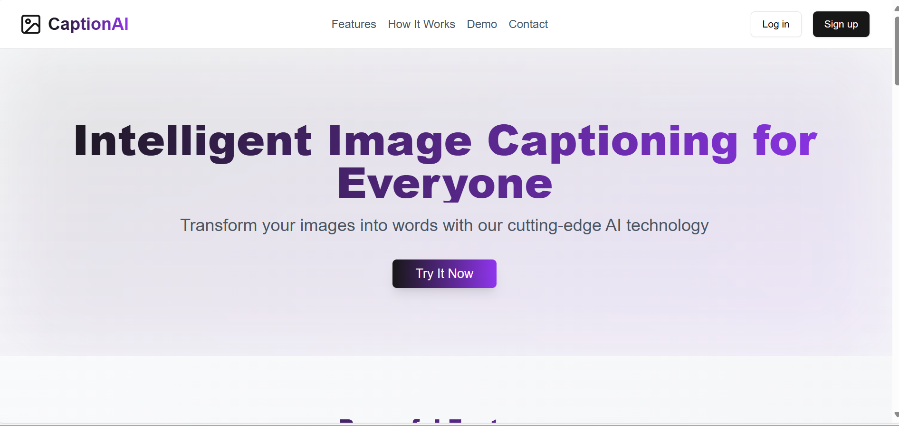
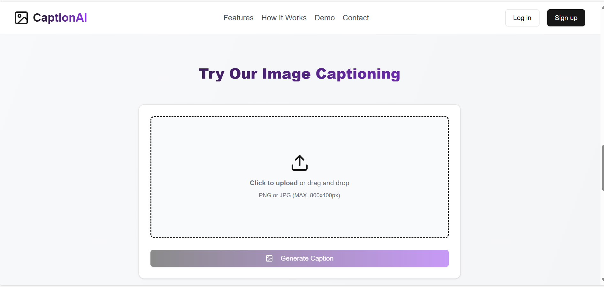

# Image Caption Generation with AI

This project leverages artificial intelligence to generate captions for images. The system uses a machine learning model to describe the contents of an image in human-readable language. The application consists of both frontend and backend components.

## Table of Contents

- [Overview](#overview)
- [Features](#features)
- [Tech Stack](#tech-stack)
- [Backend Setup](#backend-setup)

## Overview

This project is an Image Caption Generation application that allows users to upload images and receive a caption describing the content of the image. The backend is powered by a machine learning model that processes the uploaded image and generates a caption. The frontend provides a user-friendly interface to interact with the system.

### Key Features:
- Upload an image from the frontend.
- Receive AI-generated captions for the uploaded image.
- Simple user authentication and logout functionality.
- Responsive, modern user interface with smooth animations.

## Demo
 

## Tech Stack

### Frontend:
- **React.js**: JavaScript library for building the user interface.
- **Tailwind CSS**: Utility-first CSS framework for fast UI development.
- **Framer Motion**: Animation library for smooth transitions and animations.
- **Axios**: HTTP client for making requests to the backend.
- **Lucide React Icons**: Set of React icons used for UI elements.

### Backend:
- **Flask**: Micro web framework for building the API.
- **TensorFlow / PyTorch**: Deep learning frameworks for the image captioning model.
- **Python**: The backend language used for AI processing.
- **Flask-RESTful**: Extension for building REST APIs in Flask.
- **PostgreSQL**: Database for storing user authentication information (optional).
- **Redis**: Used for caching and managing sessions (optional).

## Backend Setup

### Prerequisites
- Python 3.7 or later
- Flask
- TensorFlow or PyTorch (depending on the model)
- PostgreSQL (optional)
- Redis (optional)

